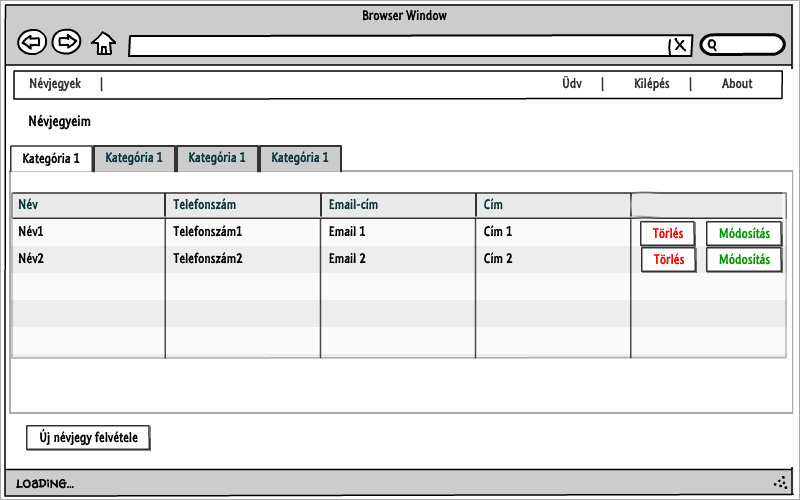
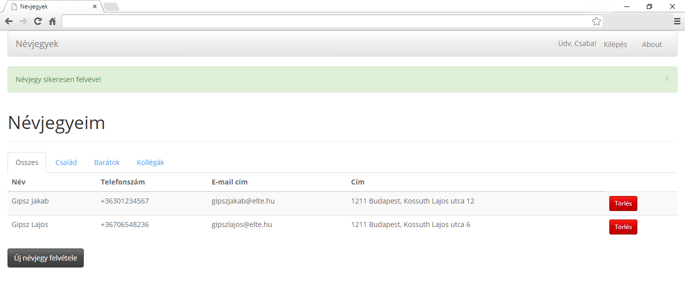
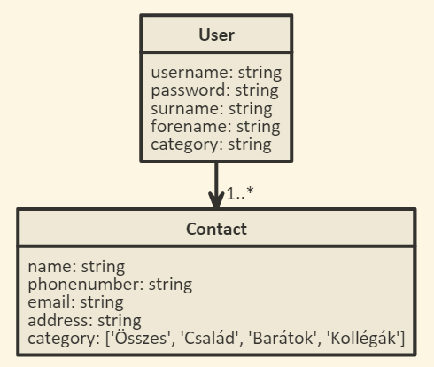

## ELTE Alkalmazások fejlesztése 1. beadandó
Bojtos Csaba (FWCSZH)

## Névjegykezelő

### Követelményanalízis
A beadandó célja egy kis webes alkalmazás elkészítése szerveroldali technológiák segítségével. 
A feladatnak minimálisan tartalmaznia kell:

* legalább két modellt, egy-sok kapcsolatban
* legalább 1 űrlapot
* legalább 1 listázó oldalt
* legyen lehetőség új felvételére
* legyen lehetőség meglévő szerkesztésére
* legyen lehetőség meglévő törlésére
* legyenek benne csak hitelesítés után elérhető funkciók
* perzisztálás fájlba történjen
* közzététel Herokun

#### Használatieset-modell

Az alkalmazásban a felhasználóknak névjegyeik tárolására van lehetőségük. Az oldal használatához registrációra van szükség. A regisztrálás után lehetőség van névjegyek felvételére – név, telefonszám, e-mail cím és cím mezők kötelező megadásával. A névjegyek kategóriákba sorolhatóak, így meg lehet jeleníteni a csak egy kategóriába tartozó névjegyeket. Az alkalmazás funkciói közé tartozik továbbá a névjegyek törlése és módosítása is.

### Tervezés
#### Végpontok
Az oldal az alábbi végpont-szerkezet alapján épül fel:

+ **contacts/**  
  + **list** A névjegyek megtekintése
  + **new** Új névjegy felvétele
  + **delete{id}** Kiválasztott névjegy törlése
  + **modificate{id}** Kiválasztott névjegy módosítása
+ **auth/**
  + **login** Bejelentkezés
  + **signup** Regisztráció
  + **logout** Kijelentkezés
+ **about** Az alkalmazásról szóló információk megtekintése

#### Oldalvázlat



#### Az alkalmazás kinézete a végleges megvalósításban



#### Osztálymodell



### Implementáció
Az alkalmazás a node.js keretrendszer felhasználásával a Cloud9 (c9.io) platformon készült, 
és a Heroku platformon lett publikálva: [http://nevjegyek.herokuapp.com](http://nevjegyek.herokuapp.com)

**Felhasznált technológiák:**
+  **[node.js](https://nodejs.org)**
+  **[bcryptjs](https://www.npmjs.com/package/bcryptjs)**
+  **[body-parser](https://www.npmjs.com/package/body-parser)**
+  **[Chai](http://chaijs.com/)**
+  **[connect-flash](https://github.com/jaredhanson/connect-flash)**
+  **[express](http://expressjs.com)**
+  **[express-session](https://github.com/expressjs/session)**
+  **[express-validator](https://github.com/ctavan/express-validator)**
+  **[hbs](https://github.com/donpark/hbs)**
+  **[Mocha](https://mochajs.org)**
+  **[Passport](http://passportjs.org)**
+  **[Sails-Disk](https://github.com/balderdashy/sails-disk)** 
+  **[sails-memory](https://github.com/balderdashy/sails-memory)**
+  **[waterline](https://github.com/balderdashy/waterline)** 
+  **[zombie](https://github.com/brianmcd/zombie)** 
+  **[Bootstrap](http://getbootstrap.com)**  
+  **[Bootswatch](http://bootswatch.com)**  
+  **[jQuery](https://jquery.com/)**   

**Könyvtárstruktúrában lévő mappák funkciói:**
+ **controller/** A felhasználói műveletek feldolgozása
+ **documentation/** Ezen dokumentációhoz tartozó képek
+ **models/** user illetve contact modellek
+ **public/** Megjelenítéshez szükséges statikus fájlok helye (CSS)
+ **views/** Megjelenítéshez szükséges sablonok (nézetek) helye
+ **bower.json** Függőségek definiálására szolgál
+ **fooldal.html** Főoldal
+ **package.json** Az alkalmazás alapadatait illetve függőségeit tartalmazza
+ **README.md** Ezen dokumentáció
+ **server.js** A végpontok (vezérlők) és az alapvető funkcionalitások implementációját tartalmazza

### Tesztelés
2 szintű tesztelést végeztem végre:
* A modellek egységtesztelését Chai és Zombie keretrendszerek segítségével teszteltem
A teszteket a következő paranccsal tudjuk lefuttatni:
```
  $ npm test
```
* Selenium IDE segítségével funkcionálisan is teszteltem az oldalt

### Felhasználói dokumentáció
Szerver oldalon a node csomag megléte alapkövetelmény. A kliens oldal bármilyen, böngészővel rendelkező eszközzel használható.

#### Telepítés
Github projekt klónozása: 
```
$ git clone https://github.com/bojtoscsabi/alkfejl.git
```
Dependenciák feltelepítése:
```
$ npm install --save
$ bower install --save
```
Alkalmazás indítása:
```
$ npm start
```
